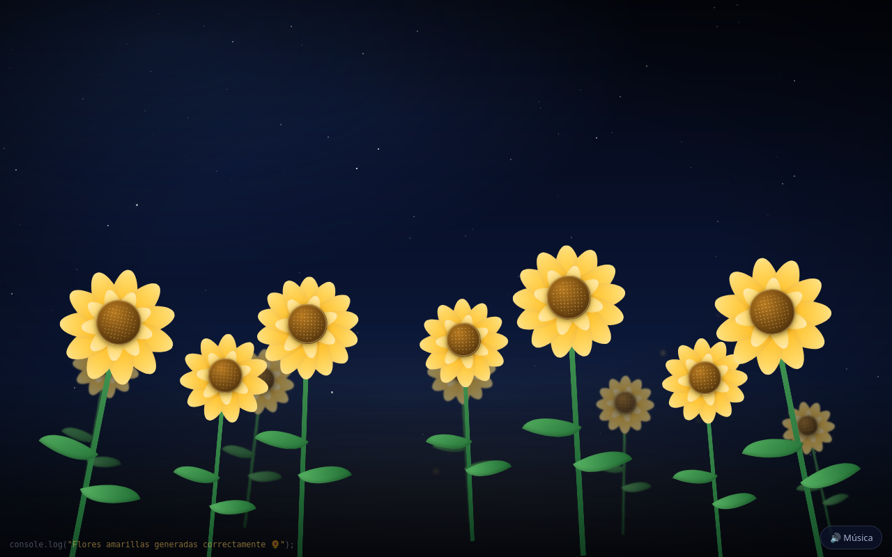

# 🌻 Flores amarillas

Un pequeño jardín de flores amarillas hecho **a mano con HTML5, CSS3 y JavaScript vanilla**.
Sin frameworks, sin dependencias, sin build. Se abre haciendo doble clic en `index.html`.



> Las flores de verdad se marchitan. Estas solo dejan de funcionar si se cae el hosting.

## ✨ Qué hace

1. **Intro** — pantalla oscura, los textos aparecen uno a uno y termina con el botón *Ver tus flores 🌻*.
2. **El jardín crece** — cada flor nace por partes: tallo → hojas → centro → pétalos → vaivén de viento.
   Ninguna aparece al mismo tiempo que otra: hay dos planos (fondo y frente) con retrasos escalonados.
3. **Interacción** — al pasar el mouse la flor se inclina, los pétalos se mueven y aparece un brillo.
   Al tocarla salta una tarjeta flotante con un mensaje aleatorio.
4. **Momento especial** — cuando el jardín termina de crecer aparece el mensaje central.
5. **Pétalos cayendo** — generados desde JS, con deriva lateral, giro y velocidades distintas.
6. **Final** — el botón *Hay una última cosa 👀* enciende todo el jardín.

## 📁 Estructura

```
flores-amarillas/
├── index.html          # marcado semántico + escena
├── css/
│   └── style.css       # tokens, escena nocturna, anatomía de la flor, keyframes
├── js/
│   └── app.js          # secuencias, generación del jardín, partículas, audio
├── assets/
│   ├── audio/          # (opcional) musica.mp3
│   └── images/
└── README.md
```

## 🌱 Cómo se construye una flor

Cada flor es puro CSS: sin imágenes ni emojis. El HTML que genera `app.js` es:

```
.flower            → posición, tamaño (--s) e inclinación (--tilt)
└ .flower__sway    → vaivén de viento (rotación infinita)
  ├ .flower__stem  → tallo con degradado verde (scaleY desde abajo)
  ├ .flower__leaf  → dos hojas que crecen con scale + rotación propia
  └ .flower__bloom → corola
    ├ .bloom__glow → halo al pasar el mouse
    ├ .bloom__ring--outer → 10–14 pétalos
    ├ .bloom__ring--inner → 6–9 pétalos más claros
    └ .bloom__core → centro con textura de semillas
```

Todas las variaciones (tamaño, inclinación, número de pétalos, velocidad del viento, retraso de
crecimiento) viajan como **variables CSS** que JavaScript escribe en el `style` de cada flor.
Así el navegador anima todo con `transform` y `opacity`, que corren en la GPU.

## 🎵 Música (opcional)

La página funciona perfectamente **sin ningún archivo de audio**.
Si quieres música ambiental, coloca un archivo en:

```
assets/audio/musica.mp3
```

El botón 🔊 aparece después de entrar al jardín. Nunca se reproduce sola (los navegadores lo
bloquean y, la verdad, la música automática asusta). Si el archivo no existe, el botón se
despide solo y no se rompe nada.

## ♿ Accesibilidad y rendimiento

- Respeta `prefers-reduced-motion`: sin vaivén, sin lluvia de pétalos y secuencias abreviadas.
- Flores accesibles por teclado (`Tab` + `Enter`/`Espacio`) con `aria-label`.
- Textos con `role="status"` y `aria-live` para lectores de pantalla.
- Solo se animan `transform`, `opacity` y `filter`; nada de `left`/`top` en bucle.
- Número de estrellas, luciérnagas, flores y pétalos calculado según el tamaño de pantalla.

## 📱 Responsive

Pensada primero para celular (probablemente se abra desde WhatsApp): `100dvh`, sin scroll
horizontal, tamaños en `clamp()` + `vmin`, ajustes para landscape bajito y soporte de
`safe-area-inset` en iPhone.

## 🚀 Publicar el enlace

Al no tener build, sirve cualquier hosting estático. Por ejemplo con GitHub Pages:

```bash
git init
git add .
git commit -m "🌻 flores amarillas"
git branch -M main
git remote add origin <tu-repo>
git push -u origin main
# Settings → Pages → Deploy from branch → main / root
```

## 🥚 Easter eggs

- Abre la consola del navegador.
- Escribe `flores.regar()`.
- Y sí, hay un comentario escondido en el HTML.

---

Hecho con demasiadas líneas de CSS para algo que se podía comprar en una esquina. 🌻
